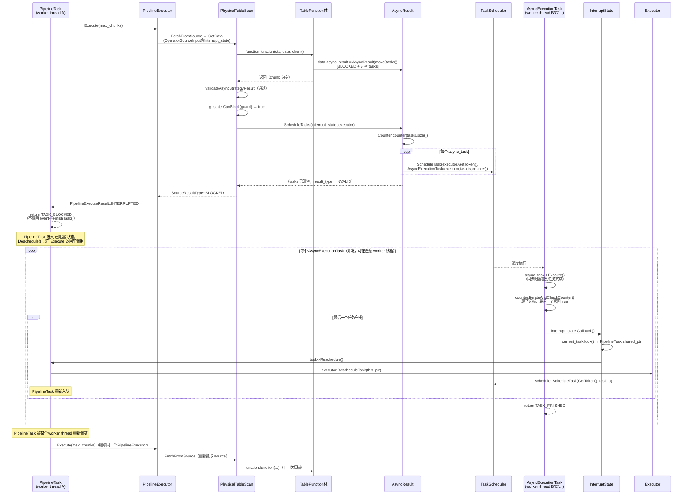

# DuckDB 异步 TableFunction 协议内部实现（Framework 视角）

## 与 ASYNC_TABLE_SCAN_DESIGN.md 的关系

`dev_docs/ASYNC_TABLE_SCAN_DESIGN.md` 覆盖的是 **TableFunction 实现者（producer）视角**：
`async_result` / `results_execution_mode` 字段的语义、`AsyncResultType` 枚举、内置 `TableScanFunc`
的用法以及自定义函数三个示例（含 BLOCKED 用法）。那篇文档是写 async TableFunction 的入门指南。

本文档覆盖的是 **框架（framework / caller）视角**：协议在 `PhysicalTableScan` 和
`PipelineExecutor` 侧的完整实现。面向读者是 **想扩展或修改异步协议本身**
的开发者，而不是只想写一个 async TableFunction 的用户。

---

## 一、源码文件总览

| 文件 | 关注范围 |
|------|------|
| `src/include/duckdb/parallel/async_result.hpp` | `AsyncResult` / `AsyncTask` / `AsyncResultsExecutionMode` 声明 |
| `src/parallel/async_result.cpp` | `AsyncExecutionTask` 内部类 + `Counter` + 构造器不变量 + `ScheduleTasks` / `ExecuteTasksSynchronously` + `ConvertToAsyncResultExecutionMode` |
| `src/include/duckdb/parallel/interrupt.hpp` | `InterruptMode` / `InterruptState` / `StateWithBlockableTasks` |
| `src/parallel/interrupt.cpp` | `InterruptState::Callback` / `InterruptDoneSignalState::Signal` / `Await` |
| `src/include/duckdb/common/enums/operator_result_type.hpp` | `SourceResultType` / `AsyncResultType` / `ExtractSourceResultType` 声明 |
| `src/function/table_function.cpp` | `ExtractSourceResultType` 实现 |
| `src/include/duckdb/function/table_function.hpp` | `TableFunctionInput`（`async_result` / `results_execution_mode` 字段，第 161–175 行） |
| `src/include/duckdb/execution/physical_operator_states.hpp` | `OperatorSourceInput`（含 `InterruptState &interrupt_state`，第 161–165 行） |
| `src/execution/operator/scan/physical_table_scan.cpp` | `GetDataInternal`（第 159–210 行）；`ValidateAsyncStrategyResult`（第 104–157 行） |
| `src/include/duckdb/execution/physical_table_scan_enum.hpp` | `PhysicalTableScanExecutionStrategy` 枚举（第 15–20 行） |
| `src/include/duckdb/parallel/pipeline_executor.hpp` | `PipelineExecutor::interrupt_state` 字段 + `SetTaskForInterrupts` / `FetchFromSource` |
| `src/parallel/pipeline_executor.cpp` | `FetchFromSource`（第 526–540 行）；`GetData`（第 487–504 行）；`Execute` 循环（第 188–260 行） |
| `src/include/duckdb/parallel/pipeline.hpp` | `PipelineTask` 声明 |
| `src/parallel/pipeline.cpp` | `PipelineTask::ExecuteTask`（第 33–66 行） |
| `src/parallel/executor_task.cpp` | `ExecutorTask::Deschedule` / `Reschedule`（第 27–35 行） |
| `src/parallel/executor.cpp` | `Executor::AddToBeRescheduled` / `RescheduleTask`（第 495–511 行）；`InitializeInternal`（producer 初始化，第 388–426 行） |
| `src/parallel/task_scheduler.cpp` | `TaskScheduler::ScheduleTask`（第 258–261 行） |
| `src/include/duckdb/common/multi_file/multi_file_function.hpp` | `MultiFileFunction` 在 SYNCHRONOUS 模式下调用 `ExecuteTasksSynchronously`（第 619–634 行） |

---

## 二、生命周期视角：一次 GetData 调用的完整链路

### 2.1 入口：PipelineTask 调用链

每条 pipeline 由一个或多个 `PipelineTask` 驱动执行。`PipelineTask` 是
`ExecutorTask` 的子类，其 `ExecuteTask` 方法（`pipeline.cpp:33`）在被 worker thread
调度执行时：

1. 懒构造 `PipelineExecutor`（如不存在）。
2. 调用 `pipeline_executor->SetTaskForInterrupts(shared_from_this())`（`pipeline.cpp:38`），
   将自身的 `weak_ptr<Task>` 注册进 `PipelineExecutor::interrupt_state`，使后续 source/sink
   操作的中断回调能够找回这个 task。
3. 调用 `pipeline_executor->Execute(max_chunks)`，进入执行循环。

执行循环（`pipeline_executor.cpp:188`）的"正常抓取"分支：

```
source_chunk.Reset();
source_result = FetchFromSource(source_chunk);   // pipeline_executor.cpp:230
if (source_result == SourceResultType::BLOCKED)
    return PipelineExecuteResult::INTERRUPTED;   // 上浮到 PipelineTask::ExecuteTask
```

`PipelineTask::ExecuteTask` 收到 `TASK_BLOCKED` 后直接返回，不调用 `event->FinishTask()`，
即整个 pipeline task 进入"已阻塞、等待重唤"状态。

### 2.2 FetchFromSource → PhysicalTableScan::GetData

`FetchFromSource`（`pipeline_executor.cpp:526`）构造 `OperatorSourceInput`，并将
`PipelineExecutor` 持有的 `interrupt_state` 注入其中：

```cpp
// pipeline_executor.cpp:529
OperatorSourceInput source_input = {*pipeline.source_state, *local_source_state, interrupt_state};
auto res = GetData(result, source_input);
```

`GetData`（`pipeline_executor.cpp:487`）在非调试模式下直接调用
`pipeline.source->GetData(context, chunk, input)`，即
`PhysicalTableScan::GetData` → `GetDataInternal`。

关键设计点：`InterruptState` 是 `OperatorSourceInput` 的字段，而 **不是**
`TableFunctionInput` 的字段。原因详见第五节。

### 2.3 GetDataInternal 中的 function.function 路径

`PhysicalTableScan::GetDataInternal`（`physical_table_scan.cpp:159`）中，
`function.function` 存在时走以下步骤：

**步骤 1：构造 TableFunctionInput 并设置初始状态**

```cpp
// physical_table_scan.cpp:165–173
TableFunctionInput data(bind_data.get(), l_state.local_state.get(), g_state.global_state.get());
data.async_result = AsyncResultType::IMPLICIT;  // 约定初始值，函数可选择覆盖
const auto initial_async_result = data.async_result.GetResultType();
const auto execution_strategy = g_state.physical_table_scan_execution_strategy;
const auto input_execution_mode = AsyncResult::ConvertToAsyncResultExecutionMode(execution_strategy);
data.results_execution_mode = input_execution_mode;
```

`TableFunctionInput` 的 `async_result` 默认值是 `AsyncResultType::INVALID`（
`table_function.hpp:173`），此处框架将其覆盖为 `IMPLICIT`，向函数体传达"你可以直接返回
不设置 async_result，框架会根据 chunk.size() 判断结果"的语义。

`results_execution_mode` 默认值同样为 `SYNCHRONOUS`（`table_function.hpp:174`），
框架在调用前依据 `execution_strategy` 覆盖为正确的执行模式，让函数体知道当前是否可以产生 BLOCKED。

**步骤 2：调用 TableFunction 体**

```cpp
// physical_table_scan.cpp:176
function.function(context.client, data, chunk);
```

调用期间 TableFunction 可能：
- 保持 `data.async_result = IMPLICIT`（隐式结果，框架根据 chunk 判断）
- 设置 `data.async_result = AsyncResultType::FINISHED`（明确扫描完成）
- 设置 `data.async_result = AsyncResultType::HAVE_MORE_OUTPUT`（明确有更多数据）
- 设置 `data.async_result = AsyncResult(std::move(tasks))`（BLOCKED，有异步任务）

**步骤 3：读取结果并校验**

```cpp
// physical_table_scan.cpp:178–183
const auto output_async_result = data.async_result.GetResultType();
ValidateAsyncStrategyResult(execution_strategy, input_execution_mode,
                            data.results_execution_mode,
                            initial_async_result, output_async_result,
                            chunk.size());
```

**步骤 4：按 output_async_result 分发**

```cpp
// physical_table_scan.cpp:186–210
switch (output_async_result) {
case AsyncResultType::BLOCKED:
    // 检查 GlobalSourceState 是否允许阻塞
    auto guard = g_state.Lock();
    if (g_state.CanBlock(guard)) {
        data.async_result.ScheduleTasks(input.interrupt_state, executor);
        return SourceResultType::BLOCKED;
    }
    return SourceResultType::FINISHED;  // 已经无法阻塞，直接结束（不常见）
case AsyncResultType::IMPLICIT:
    return chunk.size() > 0 ? SourceResultType::HAVE_MORE_OUTPUT : SourceResultType::FINISHED;
case AsyncResultType::FINISHED:
    return SourceResultType::FINISHED;
case AsyncResultType::HAVE_MORE_OUTPUT:
    return SourceResultType::HAVE_MORE_OUTPUT;
}
```

BLOCKED 分支的 `CanBlock` 检查来自 `GlobalSourceState`（继承自 `StateWithBlockableTasks`）：
若 `can_block == false`（已调用 `PreventBlocking`），则拒绝阻塞，直接返回 FINISHED。
这是一个资源控制阀门，防止 pipeline 关闭阶段仍有任务被阻塞挂起。

---

## 三、BLOCKED 路径完整时序

### 3.1 时序图



### 3.2 关键 happens-before 链路说明

**链路 1：`ScheduleTask` → `AsyncExecutionTask::ExecuteTask`**

`ScheduleTasks`（`async_result.cpp:86`）通过 `TaskScheduler::GetScheduler(executor.context).ScheduleTask(executor.GetToken(), task)` 把每个 `AsyncExecutionTask` 推入调度队列（`task_scheduler.cpp:258`），其中 `task` 类型为 `shared_ptr<AsyncExecutionTask>`。任意空闲 worker thread 在 `ExecuteForever` 循环中 dequeue 后立即执行 `task->Execute()`，后者调用 `ExecuteTask(mode)`.

**链路 2：`async_task->Execute()` 的执行语义**

`AsyncExecutionTask::ExecuteTask`（`async_result.cpp:34`）：

```cpp
TaskExecutionResult ExecuteTask(TaskExecutionMode mode) override {
    async_task->Execute();             // 同步阻塞，直到 AsyncTask 完成所有 I/O 或计算
    if (counter->IterateAndCheckCounter()) {
        interrupt_state.Callback();    // 仅当 counter 降到 0 时触发
    }
    return TaskExecutionResult::TASK_FINISHED;
}
```

`Execute()` 是 **同步调用**。`AsyncTask` 内部可以进行阻塞 I/O（如文件读取），
完成后才返回。这意味着 async task worker thread 在 I/O 期间是真正占用的，
而不是协程式挂起。框架的并发性来自多 task（每个 `AsyncResult` 可携带多个任务），
以及 worker pool 的并发执行能力。

**链路 3：Counter 机制**

`Counter`（`async_result.cpp:14`）是一个原子计数器，初始值 = `async_tasks.size()`。
每个 `AsyncExecutionTask` 共享同一个 `shared_ptr<Counter>`。每次 `IterateAndCheckCounter`
原子地将 counter 减一，仅当减后值为 0 时返回 `true`（`async_result.cpp:19`）。
这保证：无论多少个任务，Callback 恰好触发一次，且在**所有任务完成之后**。

**链路 4：`interrupt_state.Callback()` → PipelineTask 重唤**

`InterruptState::Callback`（`interrupt.cpp:18`）在 TASK 模式下：

```cpp
auto task = current_task.lock();  // weak_ptr → shared_ptr，若 task 已销毁则为 nullptr
if (!task) { return; }            // no-op：task 已死（pipeline 被取消等情况）
task->Reschedule();
```

`task->Reschedule()`（`executor_task.cpp:32`）→ `executor.RescheduleTask(this_ptr)`
→ `scheduler.ScheduleTask(GetToken(), task_p)`（`executor.cpp:506`），将原 `PipelineTask`
重新投入调度队列。此后某个 worker thread 再次 dequeue 并执行该 task，
pipeline 从 `BLOCKED` 恢复继续扫描。

**链路 5：重新调度后的执行上下文连续性**

重新调度的 `PipelineTask` 复用同一个 `PipelineExecutor` 实例（`pipeline.cpp:34`，
`pipeline_executor` 是 `PipelineTask` 的字段，BLOCKED 返回时不被销毁）。
`PipelineExecutor` 持有 `LocalSourceState` 和 `LocalSinkState`，因此局部扫描状态连续。
重新执行时，`SetTaskForInterrupts(shared_from_this())` 再次被调用（`pipeline.cpp:38`），
更新 `interrupt_state` 中的 `weak_ptr<Task>`，指向新的调度实例。

---

## 四、不变量清单与校验点

### 4.1 AsyncResult 构造时的不变量

**不变量 A**（`async_result.cpp:56`）：用非 BLOCKED 的 `AsyncResultType` 构造 `AsyncResult`
时，如果显式传入 `BLOCKED`，会立刻抛出 `InternalException`：

```cpp
// async_result.cpp:55–58
AsyncResult::AsyncResult(AsyncResultType t) : result_type(t) {
    if (result_type == AsyncResultType::BLOCKED) {
        throw InternalException("AsyncResult constructed with a BLOCKED state, do provide AsyncTasks");
    }
}
```

**不变量 B**（`async_result.cpp:61`）：用 `vector<unique_ptr<AsyncTask>>` 构造时，
若 vector 为空，立刻抛出：

```cpp
AsyncResult::AsyncResult(vector<unique_ptr<AsyncTask>> &&tasks)
    : result_type(AsyncResultType::BLOCKED), async_tasks(std::move(tasks)) {
    if (async_tasks.empty()) {
        throw InternalException("AsyncResult constructed from empty vector of tasks");
    }
}
```

即：**BLOCKED 状态的 AsyncResult 必须且只能通过带非空 tasks 的构造器产生**。

### 4.2 HasTasks / GetResultType 的 assertion 关系

`GetResultType`（`async_result.cpp:143`）：

```cpp
AsyncResultType AsyncResult::GetResultType() const {
    D_ASSERT(result_type != AsyncResultType::INVALID);
    if (async_tasks.empty()) {
        D_ASSERT(result_type != AsyncResultType::BLOCKED);
    } else {
        D_ASSERT(result_type == AsyncResultType::BLOCKED);
    }
    return result_type;
}
```

`HasTasks`（`async_result.cpp:133`）具有对称的 assertion。这两个方法互为佐证：
`tasks.empty() ↔ result_type ≠ BLOCKED`，在 DEBUG 模式下违反会立即触发
`D_ASSERT`。

### 4.3 ValidateAsyncStrategyResult 的校验规则

`ValidateAsyncStrategyResult`（`physical_table_scan.cpp:104`）在 `function.function`
调用**前后**进行校验，违反任何一条均抛出 `InternalException`：

| 校验条件 | 说明 |
|---|---|
| `execution_mode_pre == ConvertToAsyncResultExecutionMode(strategy)` | 框架初始化的 execution_mode 必须与 strategy 一致（`physical_table_scan.cpp:109`） |
| `execution_mode_pre == execution_mode_post` | TableFunction 体**不得修改** `results_execution_mode`（`physical_table_scan.cpp:116`） |
| `result_pre == IMPLICIT` | 调用前框架已将 async_result 设为 IMPLICIT，任何非 IMPLICIT 的初始状态均为异常（`physical_table_scan.cpp:121`） |
| SYNCHRONOUS / FORCE_SYNC_CHECKS 策略下：`result_post ≠ BLOCKED` | 同步模式不允许函数返回 BLOCKED（`physical_table_scan.cpp:133`） |
| SYNCHRONOUS 策略下：FINISHED 时 `chunk.size() == 0`（`physical_table_scan.cpp:136`） | FINISHED 意味着扫描终止，chunk 必须为空 |
| SYNCHRONOUS 策略下：HAVE_MORE_OUTPUT 时 `chunk.size() > 0`（`physical_table_scan.cpp:141`） | HAVE_MORE_OUTPUT 意味着本次有数据输出 |
| 其他策略下：BLOCKED 时 `chunk.size() == 0`（`physical_table_scan.cpp:150`） | BLOCKED 时不允许同时返回数据 |

### 4.4 ScheduleTasks 的前置条件

`AsyncResult::ScheduleTasks`（`async_result.cpp:86`）：

- `result_type` 必须为 `BLOCKED`，否则抛出。
- `async_tasks` 必须非空，否则抛出。

调用后：`async_tasks` 被 `std::move` 进 `AsyncExecutionTask`，框架不再持有原 tasks；
`result_type` 并不被重置（仍为 BLOCKED），但外部已不再读取（`GetDataInternal` 直接 `return`）。
注意：`ScheduleTasks` 不改变 `result_type`，但此后 `HasTasks()` / `GetResultType()` 
会因 `async_tasks.empty()` 而触发 assertion 失败（若继续调用）。

### 4.5 ExtractSourceResultType 的不变量

`ExtractSourceResultType`（`table_function.cpp:104`）将 `AsyncResultType` 转为
`SourceResultType`，当输入为 `IMPLICIT` 或 `INVALID` 时返回 `false`，表示
**无法直接转换**。框架自身（`GetDataInternal`）不使用这个函数——它自己处理 IMPLICIT
语义；这个函数更多是辅助外部需要做类型转换的代码路径（如 `MultiFileFunction`）。

---

## 五、AsyncTask 执行语义边界

### 5.1 执行线程

`AsyncExecutionTask` 由 `TaskScheduler` 调度，在 **worker thread pool** 中的任意线程
执行（与调用 `ScheduleTasks` 的 pipeline worker 可以是同一个 pool 中的不同线程）。
`async_task->Execute()` 在该 worker thread 上**同步执行**，期间该线程被独占占用。

### 5.2 同步执行 vs 立即返回的后果

若 `AsyncTask::Execute()` 执行耗时很长（例如真实磁盘 I/O），则该 worker thread 被
阻塞，pool 中可用线程数减少。DuckDB 的 worker pool 是固定大小的（由
`threads` 配置决定），因此若所有 async tasks 都持续阻塞，可能导致整个 pool 饥饿。

这是 BLOCKED 协议的设计权衡：async task 是"让出 pipeline 线程换取 async worker 线程"
的机制，而不是完全非阻塞的协程模型。

### 5.3 Counter 机制的设计意图

单个 `AsyncResult` 可携带多个 `AsyncTask`（见 `ASYNC_TABLE_SCAN_DESIGN.md`
中的示例）。多任务时每个任务独立调度、并发执行，Counter 确保**所有任务完成后才触发一次 Callback**。

Counter 使用原子减法（`async_result.cpp:19`：`--counter`），线程安全。
`IterateAndCheckCounter` 有 `D_ASSERT(counter.load() > 0)` 保证不会 double-free，
但该 assert 仅在 DEBUG 模式有效。在 release 模式下，若某个任务未被正确追踪
（例如创建 AsyncResult 后手动移走 tasks 再 ScheduleTasks），可能导致 counter
underflow——这正是不变量 B（构造时禁止空 tasks）存在的原因之一。

---

## 六、InterruptState 与 OperatorSourceInput

### 6.1 为什么 InterruptState 不在 TableFunctionInput 中

`InterruptState` 是 `OperatorSourceInput` 的字段（`physical_operator_states.hpp:164`），
而 `TableFunctionInput` 是由 `GetDataInternal` 局部构造并传入 TableFunction 体的，
它**不包含** `InterruptState`（`table_function.hpp:161`）。

这个设计有两层含义：

1. **协议分层**：TableFunction 体通过 `AsyncResult` 输出"我有异步任务"，
   而 `InterruptState` 的绑定（"通知谁"）由框架侧在调用完成后决定。
   这解耦了函数实现与中断机制，函数体不需要知道自己被哪个 pipeline task 持有。

2. **防止误用**：如果 TableFunction 直接拿到 `InterruptState`，它可以绕过
   `AsyncResult` 机制直接在任意时刻调用 `Callback()`，这会破坏 pipeline 的
   状态机（例如在未返回 BLOCKED 的情况下触发重调度）。

### 6.2 如果想让 TableFunction 直接拿到 InterruptState

框架需要修改的地方：

1. 在 `TableFunctionInput`（`table_function.hpp:161`）中增加
   `optional_ptr<InterruptState> interrupt_state` 字段（设为 optional 保证向后兼容）。
2. 在 `GetDataInternal`（`physical_table_scan.cpp:165`）构造 `TableFunctionInput`
   时将 `input.interrupt_state` 注入进去。
3. 更新 `TableFunction` 函数签名文档，明确合法的使用方式。

**风险**：
- 函数体可以在不设置 `AsyncResult::BLOCKED` 的情况下调用 `Callback()`，
  导致 pipeline task 被误唤醒。
- 函数体可以保存 `InterruptState` 的引用跨调用使用，但
  `PipelineExecutor::interrupt_state` 每次重调度都会通过 `SetTaskForInterrupts`
  更新（`pipeline_executor.cpp:484`），老引用仍指向旧 task，在 TASK 模式下
  因 `weak_ptr` 过期而变为 no-op，行为意外但不会 crash。

---

## 七、TaskScheduler 路由与 executor token

### 7.1 ProducerToken 与 executor 的绑定

`Executor::InitializeInternal`（`executor.cpp:396`）中：

```cpp
this->producer = scheduler.CreateProducer();
```

每个 `Executor`（对应一个 query）拥有一个 `ProducerToken`，通过 `GetToken()` 暴露
（`executor.hpp:95`）。`TaskScheduler::ScheduleTask(token, task)` 将 task 挂到该 token
对应的 producer 下（`task_scheduler.cpp:258`）。

### 7.2 async task 与 pipeline task 的队列关系

`AsyncExecutionTask` 通过 `executor.GetToken()` 调度（`async_result.cpp:99`），
与 pipeline task 使用**同一个 producer token**，即同一个 executor 的队列。
`TaskScheduler` 内部使用单一 `ConcurrentQueue`（`task_scheduler.cpp:41`），
所有 executor 的任务混合排队，但通过 `ProducerToken` 可做 per-producer 的 dequeue。

这意味着：async task 和 pipeline task **共享同一 worker pool**，两者之间存在资源竞争。
若当前 query 的所有 worker thread 都被 async tasks 占满（执行耗时 I/O），
则同一 query 的其他 pipeline tasks 无法调度，整个 query 暂停。

### 7.3 对"BLOCKED 上浮后能否让出线程"的影响

当 pipeline task 返回 `TASK_BLOCKED` 后，该 worker thread **立即空出**，可以被 scheduler
分配给其他任务（包括其他 query 的 pipeline tasks 或本 query 的 async tasks）。
因此，BLOCKED 协议确实能让出 thread，但收益取决于：

- async task 是否能快速执行（若 I/O 很快，线程让出时间短，收益有限）
- worker pool 是否有其他待执行任务（若所有线程都被 async tasks 占满，让出的 pipeline
  线程也只能立刻执行 async tasks）

---

## 八、两条 BLOCKED 路径对比

DuckDB 中存在两条独立的路径让 source 返回 `SourceResultType::BLOCKED`：

### 8.1 路径 A：TableFunction via AsyncResult

在 `GetDataInternal` 的 `function.function` 分支（`physical_table_scan.cpp:187`）：

```
TableFunction 设置 data.async_result = AsyncResult(move(tasks))
  → GetDataInternal: g_state.CanBlock(guard) → ScheduleTasks → return BLOCKED
  → AsyncExecutionTask::ExecuteTask → async_task->Execute() → Callback()
  → task->Reschedule() → 重回队列
```

唤醒机制：由 `AsyncExecutionTask` 在任务完成后主动调用 `interrupt_state.Callback()`，
通过 `Reschedule()` 唤醒 pipeline task。

### 8.2 路径 B：普通 PhysicalOperator via StateWithBlockableTasks

`GlobalSourceState` 和 `GlobalSinkState` 均继承自 `StateWithBlockableTasks`
（`physical_operator_states.hpp:72, 117`）。物理算子可以直接调用：

```cpp
// interrupt.hpp:108
SourceResultType BlockSource(const unique_lock<mutex> &guard,
                              const InterruptState &interrupt_state) {
    return BlockTask(guard, interrupt_state)
        ? SourceResultType::BLOCKED : SourceResultType::FINISHED;
}
```

`BlockTask`（`interrupt.hpp:77`）将 `interrupt_state` 加入 `blocked_tasks` vector。
唤醒机制：由 **被阻塞算子的生产侧**（另一个 pipeline 或事件）在数据就绪时调用
`UnblockTasks(guard)`（`interrupt.hpp:92`），遍历 `blocked_tasks` 并调用每个的 `Callback()`。

`GetDataInternal` 的 `in_out_function` 分支（`physical_table_scan.cpp:217`）就使用路径 B：

```cpp
case OperatorResultType::BLOCKED: {
    auto guard = g_state.Lock();
    return g_state.BlockSource(guard, input.interrupt_state);
}
```

### 8.3 两条路径的统一点与差异

| | 路径 A（AsyncResult） | 路径 B（StateWithBlockableTasks） |
|---|---|---|
| **谁触发唤醒** | AsyncTask 完成后自触发 | 外部生产侧调用 `UnblockTasks` |
| **最终返回值** | `SourceResultType::BLOCKED` | `SourceResultType::BLOCKED` |
| **PipelineExecutor 反应** | 返回 `INTERRUPTED` | 返回 `INTERRUPTED` |
| **线程让出** | 是（pipeline task 返回 BLOCKED） | 是（相同） |
| **适用场景** | TableFunction 内部有异步 I/O 任务 | 算子依赖外部 pipeline 完成（如 build 侧 hash join） |
| **Callback 来源** | AsyncExecutionTask（在 worker thread） | 任意调用 `UnblockTasks` 的线程 |

两条路径在 `PipelineExecutor::Execute` 循环中**统一**处理：任何 `BLOCKED` 都使
`PipelineExecuteResult::INTERRUPTED` 上浮，`PipelineTask::ExecuteTask` 返回
`TASK_BLOCKED`，task 等待重调度（`pipeline.cpp:47`）。

---

## 九、SYNCHRONOUS 模式下的 BLOCKED 处理

### 9.1 SYNCHRONOUS 策略的含义

`PhysicalTableScanExecutionStrategy::SYNCHRONOUS` 映射到
`AsyncResultsExecutionMode::SYNCHRONOUS`（`async_result.cpp:190`）。
在此模式下，`ValidateAsyncStrategyResult` 会对 `result_post == BLOCKED` 直接抛出
（`physical_table_scan.cpp:133`），即 **框架侧拒绝 BLOCKED 上浮**。

这意味着：若 TableFunction 在 SYNCHRONOUS 策略下返回 BLOCKED，会在校验阶段就失败。
正常情况下，TableFunction 实现者通过读取 `data.results_execution_mode` 来判断
是否被允许返回 BLOCKED（见 `ASYNC_TABLE_SCAN_DESIGN.md`）。

### 9.2 ExecuteTasksSynchronously 的使用场景

`AsyncResult::ExecuteTasksSynchronously`（`async_result.cpp:103`）是框架提供给
**中间层**（如 `MultiFileFunction`）的辅助方法，而不直接被 `GetDataInternal` 调用。

`MultiFileFunction`（`multi_file_function.hpp:623`）在其 TableFunction 实现体内：

```cpp
// multi_file_function.hpp:617–634
auto res = data.reader->Scan(context, *gstate.global_state, *data.local_state, scan_chunk);
if (res.GetResultType() == AsyncResultType::BLOCKED) {
    switch (data_p.results_execution_mode) {
    case AsyncResultsExecutionMode::TASK_EXECUTOR:
        data_p.async_result = std::move(res);   // 向上透传 BLOCKED
        return;
    case AsyncResultsExecutionMode::SYNCHRONOUS:
        res.ExecuteTasksSynchronously();         // 在当前线程同步执行所有任务
        // 执行完后 result_type → HAVE_MORE_OUTPUT，循环继续扫描
        continue;
    }
}
```

当 `MultiFileFunction` 知道外层框架不接受 BLOCKED（SYNCHRONOUS 模式）时，
它在自己的 TableFunction 体内调用 `ExecuteTasksSynchronously()`，
在当前 pipeline worker thread 上**同步执行**所有 async tasks，然后继续扫描。

`ExecuteTasksSynchronously`（`async_result.cpp:103`）：

```cpp
void AsyncResult::ExecuteTasksSynchronously() {
    // 前置检查：必须是 BLOCKED 且有任务
    for (auto &async_task : async_tasks) {
        async_task->Execute();    // 同步执行，无 Counter，无 Callback
    }
    async_tasks.clear();
    result_type = AsyncResultType::HAVE_MORE_OUTPUT;  // 转换结果类型
}
```

注意：此方法**不调用 Callback**——因为没有需要唤醒的 task（当前线程就是执行者），
也不使用 Counter，直接串行执行所有任务。执行完后将 result_type 改为 `HAVE_MORE_OUTPUT`，
表示"任务已执行完毕，可以继续扫描数据"。

这是 SYNCHRONOUS 模式下 BLOCKED 语义的降级处理：把"异步 I/O，等待唤醒"退化为
"同步 I/O，原地等待完成"，保证扫描结果的语义正确性，代价是阻塞当前 pipeline 线程。

---

## 十、关键参考文件

| 文件 | 关注位置 | 说明 |
|------|---------|------|
| `src/parallel/async_result.cpp` | 第 14–50 行 | `Counter` 和 `AsyncExecutionTask` 完整实现 |
| `src/parallel/async_result.cpp` | 第 86–119 行 | `ScheduleTasks` / `ExecuteTasksSynchronously` |
| `src/parallel/async_result.cpp` | 第 183–194 行 | `ConvertToAsyncResultExecutionMode` |
| `src/parallel/interrupt.cpp` | 第 18–38 行 | `InterruptState::Callback`（TASK / BLOCKING 模式） |
| `src/execution/operator/scan/physical_table_scan.cpp` | 第 104–157 行 | `ValidateAsyncStrategyResult` 完整校验逻辑 |
| `src/execution/operator/scan/physical_table_scan.cpp` | 第 159–210 行 | `GetDataInternal` function.function 分支 |
| `src/parallel/pipeline.cpp` | 第 33–66 行 | `PipelineTask::ExecuteTask`（BLOCKED → TASK_BLOCKED 转换） |
| `src/parallel/pipeline_executor.cpp` | 第 526–540 行 | `FetchFromSource`（interrupt_state 注入点） |
| `src/parallel/executor_task.cpp` | 第 27–35 行 | `Deschedule` / `Reschedule` 实现 |
| `src/parallel/executor.cpp` | 第 495–511 行 | `RescheduleTask`（将 task 重新投入队列） |
| `src/include/duckdb/parallel/interrupt.hpp` | 第 65–125 行 | `StateWithBlockableTasks`（路径 B 的完整实现） |
| `src/include/duckdb/common/multi_file/multi_file_function.hpp` | 第 615–645 行 | `MultiFileFunction` SYNCHRONOUS 降级路径 |
